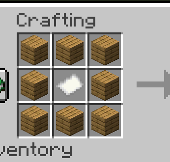
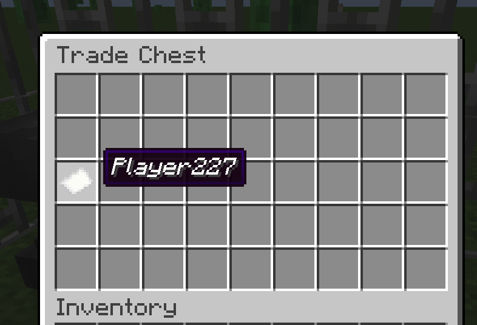
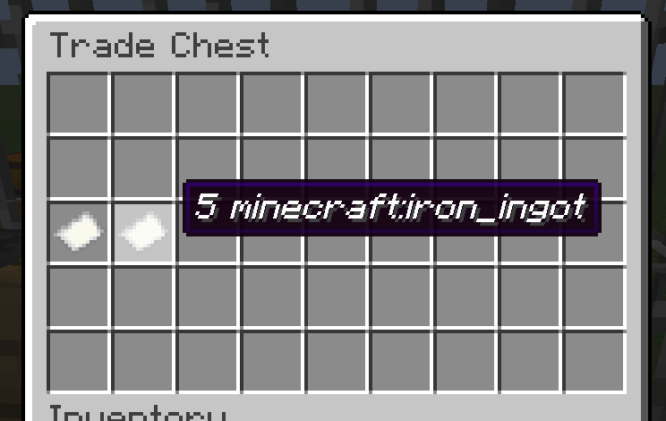
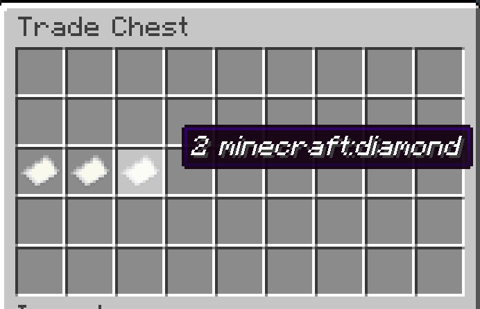
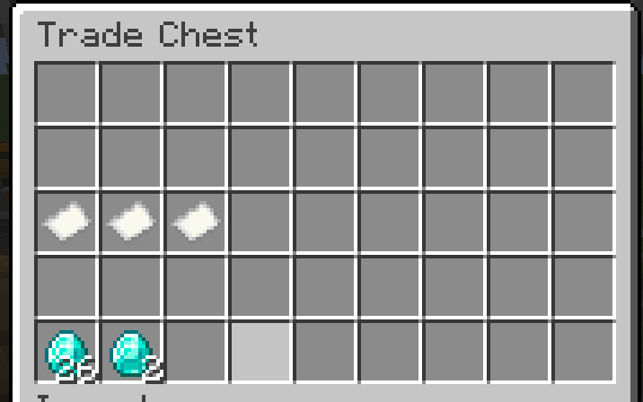

# TradeChest Mod

A Minecraft Fabric mod that adds automatic trading chests with a 9x5 inventory layout. Set up vending machine-style shops where customers place buy items and automatically receive sell items in return.


## Features

- **Automatic Trading System**: Place buy items, get sell items automatically delivered to pickup zone
- **9x5 Inventory Layout**: Dedicated areas for buy items, pickup, configuration, owner collection, and sell storage
- **Ownership System**: Secure your trade setups with username-based ownership
- **No Normal Chest Usage**: Trade chests can only be used when properly configured
- **Item Movement**: Buy items automatically move to owner collection area after trades

## Requirements

- Minecraft 1.20.1
- Fabric Loader 0.15.7+
- Fabric API
- Java 17 or higher

## Installation

### For Players

1. **Install Fabric Loader**
   - Download and run the [Fabric Installer](https://fabricmc.net/use/installer/)
   - Select Minecraft 1.20.1 and install Fabric

2. **Download Dependencies**
   - Download [Fabric API](https://modrinth.com/mod/fabric-api) for 1.20.1
   - Place the Fabric API JAR in your `.minecraft/mods` folder

3. **Install TradeChest Mod**
   - Download the latest TradeChest mod JAR file
   - Place it in your `.minecraft/mods` folder

4. **Launch Game**
   - Start Minecraft with the Fabric profile
   - The Trade Chest item will be available in the Functional Blocks creative tab

### For Developers

1. **Clone Repository**
   ```bash
   git clone https://github.com/rodortega/mc-tradechest.git
   cd mc-tradechest
   ```

2. **Build from Source**
   ```bash
   ./gradlew build
   ```

3. **Run in Development**
   ```bash
   ./gradlew runClient
   ```

## How to Use

### Crafting

Craft a Trade Chest using this recipe:



```
[Planks] [Planks] [Planks]
[Planks] [Paper ] [Planks]
[Planks] [Planks] [Planks]
```

### Basic Setup

1. **Place the Trade Chest** - Cannot be used until configured with an owner

2. **Set Ownership** (Slot 18):
   - Rename a paper with your exact username using an anvil
   - Place it in slot 18 (first slot of third row)
   - You are now the owner and can manage the chest



3. **Configure Buy Requirements** (Slot 19):
   - Rename a paper: `10 minecraft:iron_ingot`
   - Place in slot 19
   - This determines what customers must provide



4. **Configure Sell Items** (Slot 20):
   - Rename a paper: `5 minecraft:diamond`
   - Place in slot 20
   - This determines what customers receive



5. **Stock Sell Items**:
   - Place diamonds in the bottom row (slots 36-44)
   - Only the configured sell item type can be placed there



6. **Ready to Trade**:
   - Customers place iron ingots in top row (slots 0-8)
   - Diamonds automatically appear in pickup zone (slots 9-17)
   - Iron ingots move to your collection area (slots 27-35)

### Inventory Layout (9x5)

```
Row 1: [Buy Items Input Area - Customers place buy items here]           (Slots 0-8)
Row 2: [Pickup Zone - Traded items appear here automatically]           (Slots 9-17)
Row 3: [OWNER] [BUY] [SELL] [----LOCKED CONFIGURATION AREA----]         (Slots 18-26)
Row 4: [Owner Collection - Buy items go here after trades]              (Slots 27-35)
Row 5: [Sell Items Storage - Owner stocks sell items here]              (Slots 36-44)
```

### How Trading Works

1. **Customer Action**: Places 10 iron ingots in row 1
2. **Automatic Processing**: System detects complete trade
3. **Item Movement**: 
   - 5 diamonds move from row 5 to row 2 (pickup zone)
   - 10 iron ingots move from row 1 to row 4 (owner collection)
4. **Customer Pickup**: Customer takes diamonds from row 2
5. **Excess Handling**: If customer placed 15 iron, 5 excess remain in row 1 for pickup

### Example: Automatic Diamond Shop

1. **Setup Phase**:
   - Rename papers: `YourUsername`, `10 minecraft:iron_ingot`, `5 minecraft:diamond`
   - Place papers in slots 18, 19, 20 respectively
   - Stock 64 diamonds in bottom row (slots 36-44)

2. **Customer Transaction**:
   - Customer places 20 iron ingots in top row
   - System automatically processes 2 trades (20 ÷ 10 = 2)
   - 10 diamonds appear in pickup zone (5 × 2 = 10)
   - 20 iron ingots move to owner collection area
   - Customer takes 10 diamonds from pickup zone

3. **Owner Benefits**:
   - Collect 20 iron ingots from row 4 anytime
   - Restock diamonds in row 5 as needed
   - No manual intervention required

## Permissions

| Slot Range | Area | Customers Can | Owner Can |
|------------|------|---------------|----------|
| 0-8        | Buy Items Input | Place buy items, take excess | Full access |
| 9-17       | Pickup Zone | Take any items | Full access |
| 18-20      | Configuration | None | Place/remove papers |
| 21-26      | Locked Area | None | None |
| 27-35      | Owner Collection | None | Full access |
| 36-44      | Sell Storage | None | Stock sell items |

## Paper Formats

- **Owner Paper**: Just your exact username (e.g., `Steve`)
- **Buy Paper**: `[amount] [item_id]` (e.g., `10 minecraft:iron_ingot`)
- **Sell Paper**: `[amount] [item_id]` (e.g., `5 minecraft:diamond`)

## Troubleshooting

- **Can't use chest at all**: You need to place an owner paper in slot 18 first
- **Can't remove owner paper**: Make sure the paper name exactly matches your in-game username
- **Can't place buy/sell papers**: You must be the owner (have your name paper in slot 18)
- **Trading not working**: Ensure both buy and sell papers are configured in slots 19-20
- **Can't place items in bottom row**: Only the configured sell item type is allowed in slots 36-44
- **Items not moving automatically**: Check that you have sell items stocked and pickup zone isn't full

## Building

This mod uses the Fabric toolchain:

```bash
# Clean and build
./gradlew clean build

# Run client for testing
./gradlew runClient

# Generate sources jar
./gradlew sourcesJar
```

## Development

### Project Structure

- `src/main/java/com/rodmod/tradechest/` - Main mod code
- `src/main/resources/` - Assets and data files
- `build.gradle` - Build configuration
- `gradle.properties` - Project properties

### Key Classes

- `RodMod` - Main mod initializer
- `TradeChestBlock` - Block implementation
- `TradeChestBlockEntity` - Block entity with inventory logic
- `TradeChestMenu` - Container menu for GUI
- `TradeChestSlot` - Custom slot with placement restrictions

## License

This mod is available under the CC0 license. Feel free to learn from it and incorporate it in your own projects.
